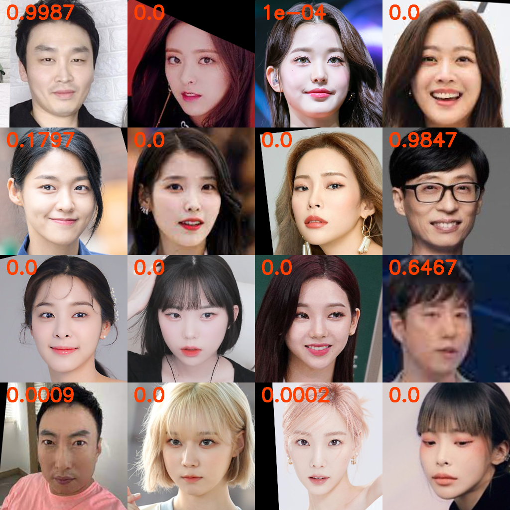

# Simple Gender Filter

Simple deep learning model predict gender of given image
(Pretrained model used aligned image)
               



## How to Use

```python
from gender_filter import GenderFilter
GF = GenderFilter
output = GF(input)
```

- input : PIL image ‘RGB’color
- output: score (Male:1, Female:0)

# Self Training

## ready

- Make forder which have named ’{data_forder}’
- Make forder ‘F’ and ‘M’ in forder which made in ‘{data_forder}’
- Put Male image in forder ‘M’, and Female image in forder ’F’

## Training

```jsx
python train.py --data_path {data_forder}
```
